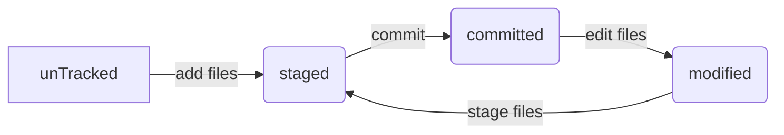

# git的日常
```
git config
git add <pathspec>(提交到暂存区staged)
git commit -m 'init'(提交到本地仓库)
git commit -m 'add get command'
git clone(克隆仓库)
get add . (一次性把所有文件提交到暂存区)
git push <remote><branch>(提交内容到远程仓库)
git status(查看当前文件的状态)
```

## 添加一个HTML文件

# git
- 产生rsa秘钥
1. 输入指令 ssh-keygen -t ras
2. 回车 回车 回车
3. 会在 C:\Users\Administrator目录下生成.ssh 文件
4. 找到 id_rsa.pub 文件 复制内容
5. 右上角settings - SSH and GPG keys - new ssh key - 随便起个名字，然后把id_rsa.pub的内容粘贴过来 - 点Add SSH key
6. 指令窗口中设定邮箱和名字
```git config --global user.email 1203160473@qq.com```
```git config --global user.name smallnine345 ```
7. 验证自己有没有设置成功
C:\Users\Administrator 下面 会生成一个.gitconfig文件，这个文件里面的内容就是设置的内容

8. 开始操作本地仓库和远程仓库了
输入指令：  
```git clone git@github.com:smallnine345/ProjectForTen.git -- yes```
```git clone + 地址```
就可以clone远程仓库的文件到本地了


- git工作区及文件状态
Working Directory(工作目录)
Staging Area(index)(暂存区)
Repository(git 仓库)

1. 在本地仓库新建一个文件，其状态就是unTracked（未跟踪的）
2. 输入指令 git add + 文件路径 
3. 其状态就变为了staged（暂存） 建立索引
4. 如果觉得当前版本没有问题，就执行 git commit -m 'init'（每commit一次就是一个版本）(单引号中的内容是备注，方便于后期版本的查找)
5. 一般来说add 和 commit 是成对出现的
6. 之前提交的文件，修改了内容，其状态就变成了modified
7. 再次执行add 和 commit 操作
8. 新增一个html文件和修改readme文件后需要的操作
```git add index.html readme.md```
```git commit -m 'add a html and change readme.md'```
9. 若一次性修改了多个文件
**git add .**
**git commit -m 'add a command'**
10. commit中的-m是什么意思（msg，备注一下本次提交版本的一些备注信息）


